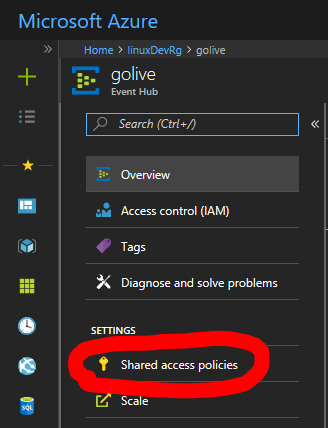
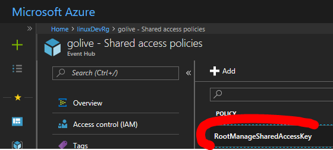
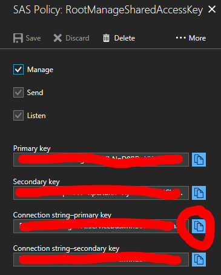
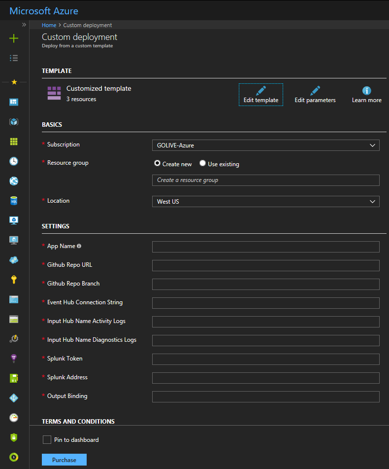

# Deploy an Azure Function using an ARM template

The SplunkVS branch contains a working version of the deployment template, tailored for a real version of a function that transmits Azure Monitor Logs to Splunk's HEC port. The Deploy to Azure button below works, as does the function it deploys.

  

## Overview

The steps to fully implement the Azure Function for Splunk are:  
* In Azure, configure the diagnostics profiles of the resources that you want to monitor.
* In Splunk, switch on the HEC port and get the token value.
* Gather the settings below.
* Click the "Deploy to Azure" button below.
* Authenticate to the Azure Portal (if necessary)
* Fill in the form with the setting values
* Wait a few minutes for the function to be created and deployed
* In the Splunk UI, watch for events to appear.

The Activity Log does not generate massive amounts of events for most users. You can see the list of event types [here](https://docs.microsoft.com/en-us/azure/monitoring-and-diagnostics/monitoring-activity-log-schema).

A new feature of Azure Monitor allows you to route all diagnostic log messages to a single event hub. See this [article](https://azure.microsoft.com/en-us/blog/azure-monitor-send-monitoring-data-to-an-event-hub/) for details.

## Settings

* AppName                     - this is the name of the function app. In the Azure Portal, this is the name that will appear in the list of resources.
* repoURL                     - this is the URL of the repo that contains the function app source.
* repoBranch                  - this is the name of the branch containing the code you want to deploy. It's usually 'master'.
* eventHubConnectionString    - this is the SAS-enabled connection string to your event hub namespace policy. 
   Here's an example: Endpoint=sb://yournamespace.servicebus.windows.net/;SharedAccessKeyName=RootManageSharedAccessKey;SharedAccessKey=yourkey
   See screenshots of how to get this value below.
* inputHubNameActivityLogs    - "insights-operational-logs" (at present, this is the correct value. It becomes configurable in future.)
* inputHubNameDiagnosticsLogs - "insights-logs-diagnostics" (for example)
* splunkAddress               - HEC "send to" address.
   Here's an example: https://YourSplunkCloudorSplunkEnterpriseAddress.cloud.splunk.com:8088/services/collector/event
* splunkToken                 - HEC token, issued by Splunk Cloud, Splunk Enterprise UI.
* outputBinding               - "hec". There may be other output bindings in future.

## How to get the Event Hub Connection String via Azure Portal

  
Navigate to your event hub namespace by selecting it from the list of resources in the resource group.  

### Select the security policy that your function should use

  
The RootManageSharedAccessKey has full control over every hub in the namespace. You only need 'read' access.  

### Copy the connection string

  
Copy the connection string, paste it into the settings dialog on deployment.

## Deployment Settings form

  
Fill in the settings values, check the box to accept T&C's, and Purchase. Here's the [page](https://azure.microsoft.com/en-us/pricing/details/functions/) describing the pricing model for Azure Functions.
